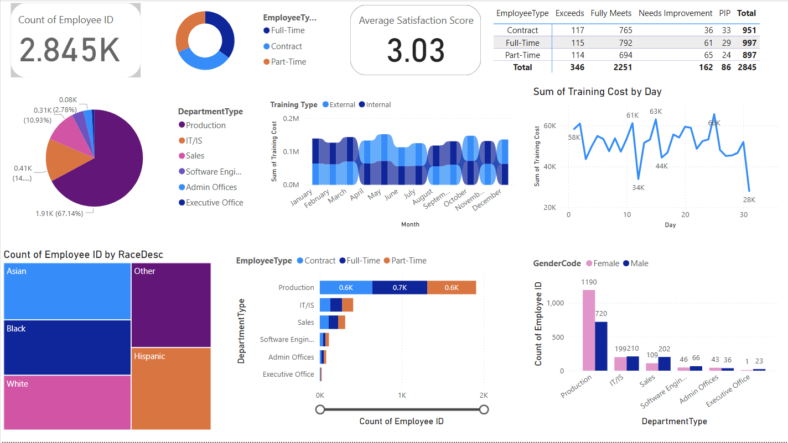

# HR Analysis Power BI Dashboard

## 📊 Overview
This Power BI dashboard provides insights into HR analytics, focusing on employee distribution, satisfaction levels, training costs, and department-wise analysis.

## 🗂 Dataset
- **Source:** Kaggle HR Dataset
- **File:** `HR.csv`
- **Description:** The dataset contains information about employees, including department, job type, satisfaction scores, training costs, and demographic distribution.

## 📈 Features & Visuals
1. **Employee Distribution:**
   - Count of employees by job type (Full-time, Contract, Part-time)
   - Distribution by race and gender
   - Department-wise employee segmentation

2. **Satisfaction & Performance Analysis:**
   - Average employee satisfaction score
   - Performance metrics (Exceeds, Fully Meets, Needs Improvement, PIP)

3. **Training Cost Analysis:**
   - Training cost trends over time
   - Internal vs. external training comparison

## 🖼 Dashboard Preview


## 🛠 How to Use
1. **Download Power BI Desktop** if you haven't already.
2. **Clone this repository**:
   ```sh
   git clone https://github.com/selengetu/HR-Analysis.git
   ```
3. **Open `HR-analysis.pbix`** in Power BI Desktop.
4. Explore interactive visuals and filter data as needed.

## 🚀 Future Improvements
- Add predictive analytics for employee retention.
- Implement a real-time data pipeline.
- Integrate additional HR metrics.

## 📌 Author
**Selenge**

If you found this project helpful, feel free to ⭐ the repository!

